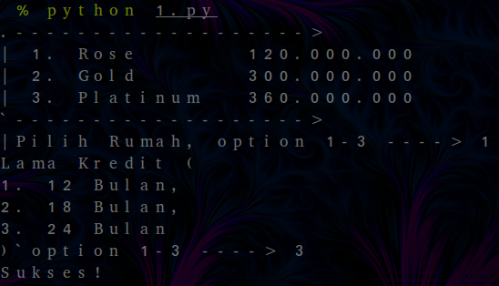
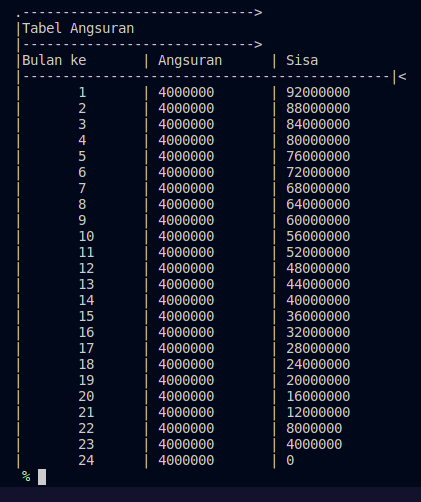

> # dumbways
> # Test batch 21 kloter 1 Dumbways.id

# Test 1
## How to run program
> python 1.py

## Documentations
### Input User

### Detail Pemilihan

### Tabel Angsuran

# Test 2 & 3
> python 2.py

Done!

> python 3.py

Done!

# Test 4
## In Progress ;>
